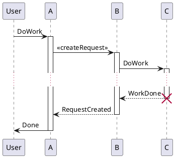
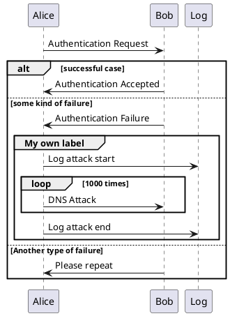

たとえば、Rubyで記述したコードをファイル名「qiita.rb」として投稿したいときは、 **バッククオート** を使用して以下のように投稿するとシンタックスハイライトが適用されます。
**コードブロック上下に空行を挿入しないと正しく表示されないことがあります。**

# これはH1タグです
## これはH2タグです
### これはH3タグです
#### これはH4タグです
##### これはH5タグです
###### これはH6タグです
*イタリック*
**強調**
~~打ち消し線~~
<details><summary>Qiita(キータ)は、プログラマのための技術情報共有サービスです。</summary>プログラミングに関することをどんどん投稿して、知識を記録、共有しましょう。
Qiitaに投稿すると、自分のコードやノウハウを見やすい形で残すことができます。
技術情報はテキストファイルへのメモではなく、タグを付けた文章、シンタックスハイライトされたコードで保存することで初めて再利用可能な知識になる、そうQiitaでは考えています。</details>

<dl>
  <dt>リンゴ</dt>
  <dd><strong>赤い</strong>フルーツ</dd>
  <dt>オレンジ</dt>
  <dd>橙色のフルーツ</dd>
</dl>

- [x] タスク1
- [ ] タスク2

> 文頭に>を置くことで引用になります。
> 複数行にまたがる場合、改行のたびにこの記号を置く必要があります。
> 引用の上下にはリストと同じく空行がないと正しく表示されません
> 引用の中に別のMarkdownを使用することも可能です。

----------------------------------

[Qiita](http://qiita.com "Qiita Home")


```python
from bluepy.btle import *

devices=[
	'd2:92:aa:c7:4a:00',
	'da:33:b3:1f:73:be',
	'e1:4a:29:77:69:72',
	'e6:de:44:81:68:d5',
	'ef:c7:a0:03:03:23'
]

peripherals=[]
characteristics=[]
MAX_RETRY=3

for dev in devices:
	print('conn : ',dev)
	for i in range(MAX_RETRY+1):
		try:
			peri=Peripheral(dev, ADDR_TYPE_RANDOM)
			char=peri.getCharacteristics(uuid='cba20002-224d-11e6-9fb8-0002a5d5c51b')
			peripherals.append(peri)
			characteristics.append(char[0])
		except BTLEException:
			print(' Retry')
		else:
			print('connected')
			break
	else:
		pass

for char in characteristics:
	print("write: ", char.peripheral.addr)
	char.write(b'\x57\x01\x02')

for per in peripherals:
	print("disc : ", per.addr)
```


| Left align | Right align | Center align |
|:---------- | -----------:|:------------:|
| This       |        This |     This     |
| column     |    `column` |    column    |
| will       |    **will** |     will     |
| be         |          be |      be      |
| left       |       right |    center    |
| aligned    |     aligned |   aligned    |

$$
1 + \frac{q^2}{(1-q)}+\frac{q^6}{(1-q)(1-q^2)}+\cdots = \prod_{j=0}^{\infty}\frac{1}{(1-q^{5j+2})(1-q^{5j+3})}, \quad\quad \text{for }\lvert q\rvert<1.
$$


* Unordered list can use asterisks
- Or minuses
  - aaaaaaa
+ Or pluses
  + bbbbbbb

## inline math
This $\begin{Bmatrix}a & b \\
 c & d\end{Bmatrix}$ is a matrix
$$\left( \sum_{k=1}^n a_k b_k \right)^{!!2} \leq \left( \sum_{k=1}^n a_k^2 \right) \left( \sum_{k=1}^n b_k^2 \right)$$

```plantuml
autonumber
Bob -> Alice : Authentication Request
Bob <- Alice : Authentication Response

autonumber 15
Bob -> Alice : Another authentication Request
Bob <- Alice : Another authentication Response

autonumber 40 10
Bob -> Alice : Yet another authentication Request
Bob <- Alice : Yet another authentication Response
```

aaa
:   Markdownはとても便利です。

bbb
:   Markdownはとても便利です。

<kbd>Ctrl</kbd> + <kbd>Shift</kbd> + <kbd>R</kbd>
<samp class="button">ファイル</samp> → <samp class="button">開く</samp> を選択して <samp class="button">OK</samp> ボタンを押下します。

```wavedrom
{ signal: [
  { name: 'clk',  wave: 'p..Pp..P'},
  ['Master',
    ['ctrl',
      {name: 'write', wave: '01.0....'},
      {name: 'read',  wave: '0...1..0'}
    ],
    { name: 'addr',   wave: 'x3.x4..x',
      data: 'A1 A2'},
    { name: 'wdata',  wave: 'x3.x....',
      data: 'D1'},
  ],
  {},
  ['Slave',
    ['ctrl',
      {name: 'ack',   wave: 'x01x0.1x'},
    ],
    {  name: 'rdata', wave: 'x.....4x',
    data: 'Q2'},
  ]
]}
```

```wavedrom
{ signal: [
  { name: 'A', wave: '01........0....',  node: '.A........j' },
  { name: 'B', wave: '0.1.......0.1..',  node: '..B.......i' },
  { name: 'C', wave: '0..1....0...1..',  node: '...C....h..' },
  { name: 'D', wave: '0...1..0.....1.',  node: '....D..g...' },
  { name: 'E', wave: '0....10.......1',  node: '.....EF....' }
  ],
  edge: [
    'A~B t1', 'C-~A t2', 'C-~>D time 3', 'D~-E',
    'E~>F', 'f->g', 'g-~>h', 'h~>i some text', 'h~->j'
  ]
}
```
```wavedrom
{reg: [
  {bits: 8 ,name: 'IPO', attr: 'RO'},
  {bits: 7},
  {bits: 5, name: 'BRK', attr: 'RW'},
  {bits: 1, name: 'CPK'},
  {bits: 3, name: 'Clear'},
  {bits: 8}
  ], config:{lanes:4, compact: true, vflip: true}}
```

```ditaa
+--------+   +-------+    +-------+
|        | --+ ditaa +--> |       |
|  Text  |   +-------+    |diagram|
|Document|   |!magic!|    |       |
|     {d}|   |       |    |       |
+---+----+   +-------+    +-------+
    :                         ^
    |       Lots of work      |
    +-------------------------+
```





<dl class="note">
  <dt>メモのタイトル</dt>
  <dd>Markdownはとても便利です。<br />
  複数行に分けて書くこともできます。</dd>
</dl>

<dl class="tip">
  <dt>ヒント</dt>
  <dd><code>{.tip}</code>を指定するとこうなります。</dd>
</dl>

<dl class="info">
  <dt>情報</dt><dd><code>{.info}</code>を指定するとこうなります。</dd>
</dl>

<dl class="warning">
  <dt>注意</dt>
  <dd><code>{.warning}</code>を指定するとこうなります。</dd>
</dl>
<dl class="caution">
  <dt>警告</dt>
  <dd><code>{.caution}</code>を指定するとこうなります。</dd>
</dl>

<article class="message is-warning is-large">
  <div class="message-header">
    <span class="icon-text">
    <span class="icon">
        <i class="fas fa-exclamation-triangle"></i>
    </span>
    <span>注意</span>
    </span>
  </div>
  <div class="message-body">
    Lorem ipsum dolor sit amet, consectetur adipiscing elit. <strong>Pellentesque risus mi</strong>, tempus quis placerat ut, porta nec nulla. Vestibulum rhoncus ac ex sit amet fringilla. Nullam gravida purus diam, et dictum <a>felis venenatis</a> efficitur. Aenean ac <em>eleifend lacus</em>, in mollis lectus. Donec sodales, arcu et sollicitudin porttitor, tortor urna tempor ligula, id porttitor mi magna a neque. Donec dui urna, vehicula et sem eget, facilisis sodales sem.
  </div>
</article>
